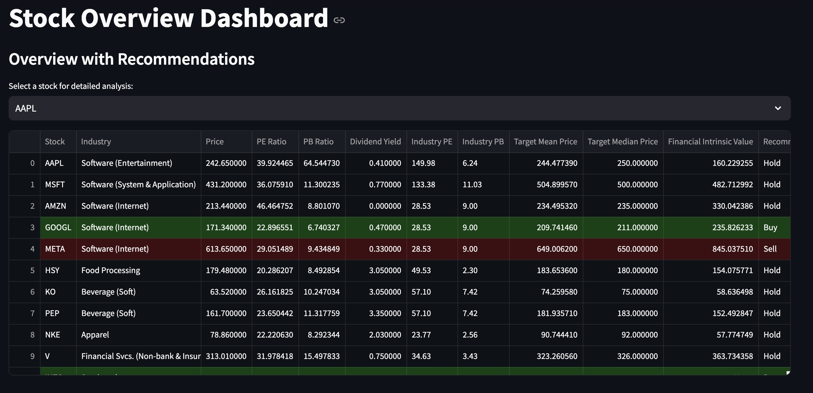
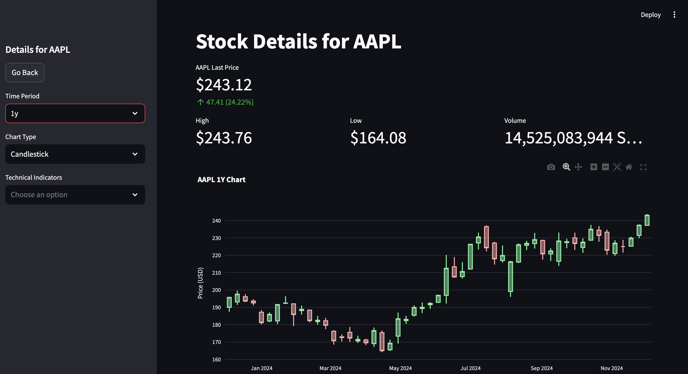

# Automated Stock Recommendation Bot

## 📈 Project Overview
The **Automated Stock Recommendation Bot** is a comprehensive platform that provides daily financial insights and actionable stock recommendations. Combining real-time financial data, calculated **intrinsic values**, and comparison with industry benchmarks, the bot offers clear guidance on whether to **buy**, **hold**, or **sell** specific stocks. The platform integrates a **Streamlit app** for interactive analysis and a **Telegram bot** for real-time notifications.

---

## 🚀 Features
- **Interactive Streamlit App**:
  - Displays stock data with color-coded recommendations.
  - Supports dynamic visualization of stock performance and technical indicators.
  - Allows users to explore detailed metrics by selecting stocks from a dropdown menu.
- **Telegram Bot Integration**:
  - Delivers financial summaries and recommendations directly to users.
- **Web Scraping**:
  - Dynamically gathers industry-specific benchmarks for P/E and P/B ratios using BeautifulSoup.
- **Yahoo Finance API**:
  - Fetches real-time stock data, including price, P/E ratio, P/B ratio, dividend yield, and industry classifications.
- **Technical Indicators**:
  - Includes moving averages like SMA and EMA for advanced stock trend analysis.
- **Recommendation Logic**:
  - Categorizes stocks as **Buy**, **Hold**, or **Sell** based on a comparison with industry benchmarks.
- **Data Cleaning and Validation**:
  - Leverages Regex for data standardization and pipelines for ensuring accuracy.
- **Scalability**:
  - Modular architecture supports additional financial metrics and multi-user capabilities.

---

## 📚 How It Works

### 1. **Streamlit App**
The Streamlit app provides an interactive dashboard where users can:
- View a table of stocks with metrics such as price, P/E ratio, P/B ratio, and dividend yield.
- Select a stock to view detailed metrics, performance trends, and technical indicators.
- Recommendations (Buy/Sell) are color-coded for ease of interpretation:
  - **Green**: Buy
  - **Red**: Sell
  - **Default**: Hold (no highlight).

### 2. **Telegram Bot**
- Sends a summary of stock data to users via Telegram.
- Includes recommendations, intrinsic values, and industry benchmarks.

### 3. **Data Workflow**
- **Stock Data Retrieval**:
  - Fetches real-time data from Yahoo Finance API.
  - Includes metrics like stock price, P/E ratio, P/B ratio, and industry classification.
- **Industry Benchmarking**:
  - Scrapes data for industry averages of P/E and P/B ratios.
- **Recommendation Logic**:
  - **Buy**: P/E and P/B ratios are below industry averages.
  - **Sell**: P/E and P/B ratios are above industry averages.
  - **Hold**: Metrics are near industry averages.

---

## ⚙️ Configuration
- **Streamlit App**:
  - Install dependencies: `pip install -r requirements.txt`
  - Run the app: `streamlit run app.py`
- **Telegram Bot**:
  - Configure the bot token and chat ID in the script (`send_telegram_message` function).
- **Yahoo Finance API**:
  - Ensure internet access for fetching real-time data.
- **Web Scraping**:
  - Industry benchmarks are dynamically scraped from publicly available sources.

---

## 🛠️ Technologies Used
- **Streamlit**: For creating the interactive app.
- **Plotly**: For dynamic stock data visualization.
- **Python**: Core programming language.
- **BeautifulSoup**: Web scraping for industry-specific benchmarks.
- **Yahoo Finance API**: Real-time stock data.
- **Telegram API**: For notifications.
- **ta (Technical Analysis Library)**: To calculate SMA and EMA indicators.

---

## 📄 Example Outputs

### Streamlit App Dashboard
**Main Page**: Displays an overview of stocks with color-coded recommendations.
- 

**Detailed Stock View**: Interactive visualization of stock metrics and performance trends.
- 

### Telegram Bot Message
```
📊 Stock Analysis Report
Stock: AAPL
Industry: Consumer Electronics
Price: $150.00
PE Ratio: 20.50 (Industry Avg: 18.00)
PB Ratio: 5.50 (Industry Avg: 6.00)
Dividend Yield: 2.00%
Intrinsic Value: $170.00
Recommendation: Buy
```

---

## 📄 License
This project is licensed under the [MIT License](LICENSE).

---

## 👨‍💻 Author
**Martin Lim**  
For inquiries or collaboration, email: martin.lim511@gmail.com  

